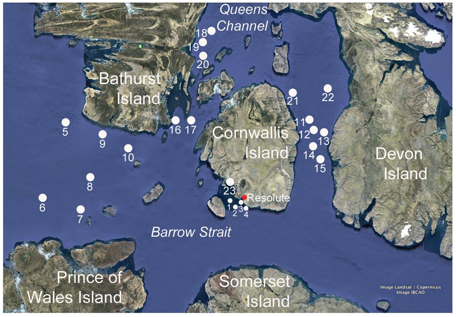

# Processing amplicon datasets
*pipeline adopted from*  [qiime2][1]

For you fourth homework, you are going to work with the datasets from [Yergeau et. al., 2017][3]

You are going to analyze the microbial community composition of the seawater and sea ice of the Canadian Arctic using qiime2.



*important note: do NOT use google maps in your papers*


The raw sequences are already downloaded in:

/vortexfs1/omics/env-bio/collaboration/common-materials/qiime-seqs/

The sequences are already demultiplexed.

You do not have to copy the sequences in your folder (actually, you should not copy the sequences to your folder). Instead you will create a "manifest" (or mapping file that qiime will use to locate the sequence).

In order to make your manifest file, you will need the SRR table (Arctic.csv). Detailed description of the format of manifest file can be found here: https://docs.qiime2.org/2019.7/tutorials/importing/

Your manifest file will also serve as the metadata file, so it should contain (besides the columns *sample-id*, *forward-absolute-filepath*, *reverse-absolute-filepath*), two more columns: the "station" identifier (note the station name in your Arctic.csv has the name "Sample Name") and the environmental material (env_material). 


## What is QIIME 2? *(from qiime website)*
QIIME 2 is a powerful, extensible, and decentralized microbiome analysis package with a focus on data and analysis transparency. QIIME 2 enables researchers to start an analysis with raw DNA sequence data and finish with publication-quality figures and statistical results.

Key features:

Integrated and automatic tracking of data provenance

Semantic type system

Plugin system for extending microbiome analysis functionality

Support for multiple types of user interfaces (e.g. API, command line, graphical)

## Data files: QIIME 2 artifacts *(from qiime website)*
Data produced by QIIME 2 exist as QIIME 2 artifacts. A **QIIME 2 artifact contains data and metadata**. The metadata describes things about the data, such as its type, format, and how it was generated (provenance). A QIIME 2 artifact typically has the **.qza** file extension when stored in a file.

Since QIIME 2 works with artifacts instead of data files (e.g. FASTA files), you must create a QIIME 2 artifact by importing data. You can import data at any step in an analysis, though typically you will start by importing raw sequence data. QIIME 2 also has tools to export data from an artifact. See the importing guide for details.

By using QIIME 2 artifacts instead of simple data files, QIIME 2 can automatically track the type, format, and provenance of data for researchers. Using artifacts instead of data files enables researchers to focus on the analyses they want to perform, instead of the particular format the data needs to be in for an analysis.

Artifacts enable QIIME 2 to track, in addition to the data itself, the provenance of how the data came to be. With an artifact’s provenance, you can trace back to all previous analyses that were run to produce the artifact, including the input data used at each step. This automatic, integrated, and decentralized provenance tracking of data enables a researcher to archive artifacts, or for example, send an artifact to a collaborator, with the ability to understand exactly how the artifact was created. This enables replicability and reproducibility of analyses, as well as generation of diagrams and text that can be used in the methods section of a paper. Provenance also supports and encourages the proper attribution to underlying tools (e.g. FastTree to build a phylogenetic tree) used to generate the artifact.

## Data files: visualizations
Visualizations are another type of data generated by QIIME 2. When written to disk, visualization files typically have the **.qzv** file extension. Visualizations contain similar types of metadata as QIIME 2 artifacts, including provenance information. Similar to QIIME 2 artifacts, visualizations are standalone information that can be archived or shared with collaborators.

In contrast to QIIME 2 artifacts, visualizations are terminal outputs of an analysis, and can represent, for example, a statistical results table, an interactive visualization, static images, or really any combination of visual data representations. Since visualizations are terminal outputs, they cannot be used as input to other analyses in QIIME 2.

>Tip
>
>Use https://view.qiime2.org to easily view QIIME 2 artifacts and visualizations files (generally .qza and .qzv files) without requiring a QIIME installation. This is helpful for sharing QIIME 2 data with collaborators who may not have QIIME 2 installed. https://view.qiime2.org also supports viewing data provenance.
>
> *since we do not have visualization in poseidon you will have to download the files locally*


### Import your demultiplexed sequences
```qiime tools import --type 'SampleData[PairedEndSequencesWithQuality]' --input-path arctic_manifest --output-path arctic_demux.qza --input-format PairedEndFastqManifestPhred33V2```

### Visualization of the demultiplexed sequences (their summary)
```qiime demux summarize --i-data arctic_demux.qza --o-visualization arctic_demux.qzv```


Rest and best in your homework repo!
:)

  [1]: https://qiime2.org/
  [2]: https://docs.qiime2.org/2019.7/install/native/
  [3]: https://www.nature.com/articles/srep42242
